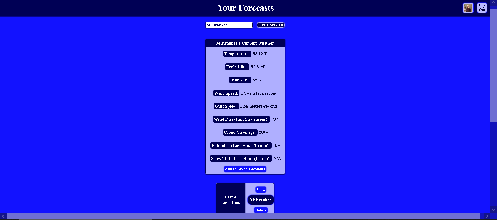

# Forecast Finder

## [Demo Video](https://www.youtube.com/watch?v=ZdGK_DUpZUM)

**Maps aren't very easy to see on the video...I guess you'll have to make an account to check out that feature ;) **

This is just a little app that I built to work on storing images to third-party cloud-based APIs (I used Cloudinary for this project) and utilizing mapbox to display interactive maps. You can look up the weather for any location easily and save locations so you can quickly access weather data.

Give it a try and feel free to make an account so you can save locations, add a profile image, and see and interact with the map.

The next step with this project is likely going to be adding forecast data and weather radar images to the map, improving search options, and fixing the bug related to saving locations that share names with other cities. (It's not always a problem, but it's pretty obvious if you want to save St.Petersburg as a location.)

I'm open to suggestions and QA comments, so feel free to reach out via Github, LinkedIn, or at my email brady.grapentine@gmail.com.
